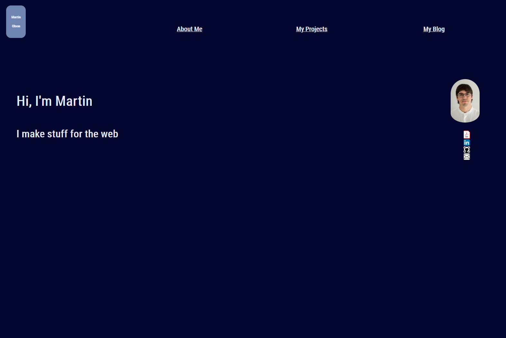
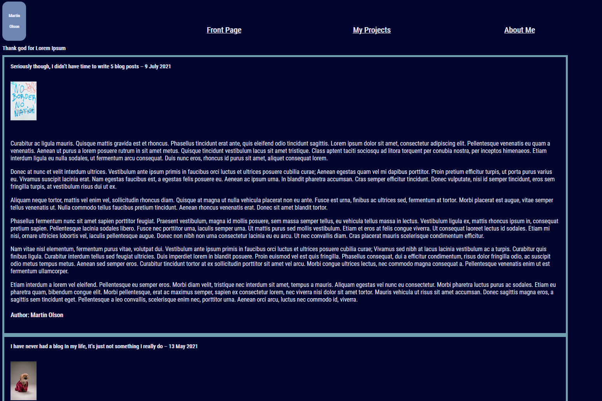
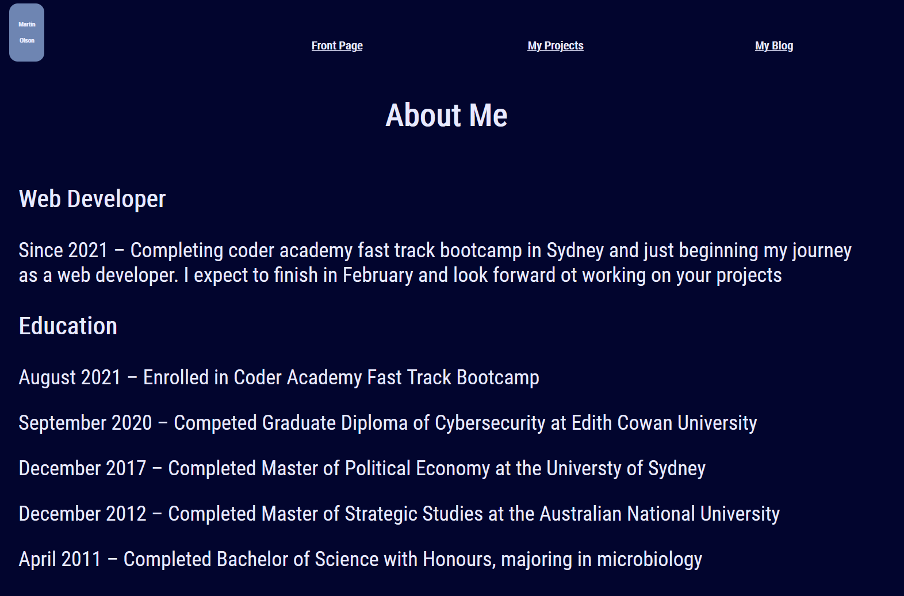
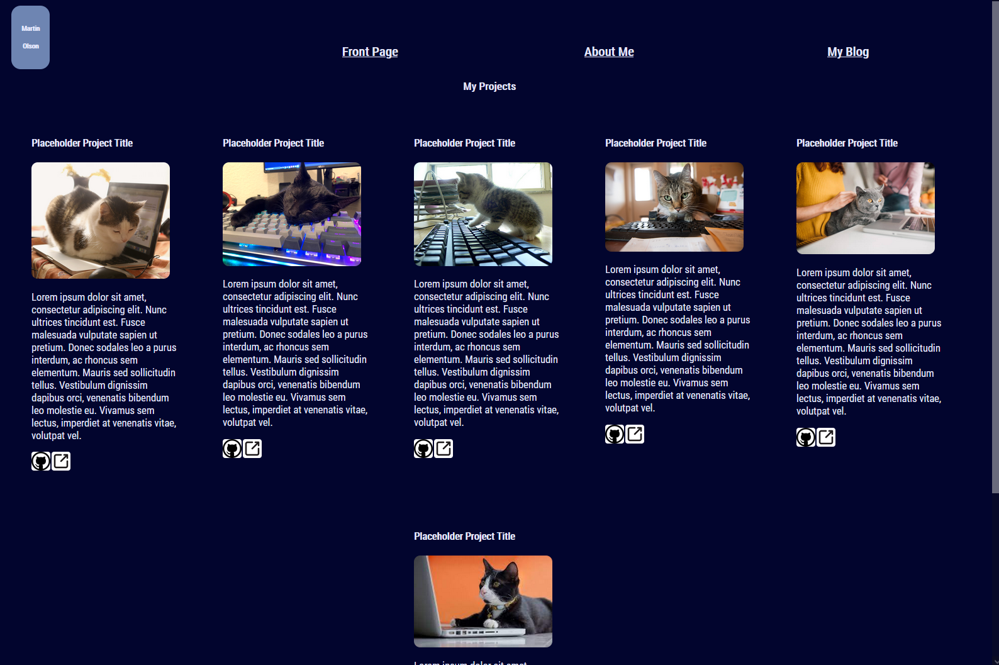

# Readme

## Link to published portfolio website and Github Repository- 
    
To whom it concerns, Please find the live version of this portfolio located at 
 https://hiremartinolson.netlify.app/

The github repository can be found at
https://github.com/MartinO55/MGOlson.github.io

## Description and Purpose of portfolio website
### Purpose
 To communicate and demonstrate my abilities to prospective employers through the use of handwritten HTML and CSS to create a portfolio website. Also submitted as part of requirements for INT1012-Introduction to Web at CoderAcademy Fast track program.

### Description
The portfolio website is split into four separate HTML pages; the landing page (index.HTML), which links to the portfolio (MyProjects.html) full of six placeholder projects, the Resume/CV page (AboutMe.html), and the blog (blog.html) with five placeholder posts.
## Features and Functionality
Validation for HTML and CSS code done using W3 markup validation service. both via address and via file upload. 2 warnings noted and ignored due to them being the result of design choices. 

Index.html lacks functionality in chrome desktop browser - Chrome displays the page at more than twice the intended width. Experimentation suggests this bug is located somewhere in the HTML code for index.html. This bug does not exist in either Firefox or Edge.

BlogStyleOBSOLETE.css remains solely for posterity and has no link to any page in the project.

With the implementation of SRI, the CSS stylesheet will now only function on the live webpage. and attempt to veiw it offline will result in the Stylesheet not loading, due to the need to patch around CVE-2019-11730 as the CSS file being in the same directory can no longer satisfy the CORS same Origin requirement.

## Sitemap
<?xml version="1.0" encoding="UTF-8">
<urlset xmlns="http://www.sitemaps.org/schemas/sitemap/0.9">
    <url>
        <loc>https://hiremartinolson.netlify.app/</loc>
        <lastmod>2021-09-02T23:39:16+00:00</lastmod>
        <priority>1.0</priority>
    </url>
    <url>
        <loc> https://hiremartinolson.netlify.app/aboutme</loc>
        <lastmod> 2021-09-02T23:39:16+00:00</lastmod>
        <priority>0.80</priority>
    </url>
    <url>
        <loc> https://hiremartinolson.netlify.app/myprojects</loc>
        <lastmod>2021-09-02T23:39:16+00:00</lastmod>
        <priority> 0.80</priority>
    </url>
    <url>
        <loc> https://hiremartinolson.netlify.app/blog.html</loc>
        <lastmod>2021-09-02T23:39:16+00:00</lastmod>
        <priority>0.50</priority>
    </url>
    <url>
        <loc> https://hiremartinolson.netlify.app/MartinOlsonCVUpdatedJan02.pdf</loc>
        <lastmod>2021-09-02T23:39:16+00:00</lastmod>
        <priority>0.80</priority>
    </url>
</urlset>

## Screenshots
Screenshot of the portfolio landing page 

Screenshot of the Blog

Screenshot of the Resume Page

Screenshot of the portfolio

## Target audience
The target audience for the portfolio website is an employer looking to engage a develpoer and/or an IT professional. the secondary target audience is the marker for coderacademy.

## Tech stack
The tech stack for this project was HTML and CSS. the deployment platform was netlify via github.io. The Source control for this project was Git, using github cloud and desktop versions. Coding accomplished in Visual Studio Code using WSL ubuntu-18.04 LTS. Design work for this project accomplished using Balsamiq wireframe maker. Built on a windows 10 operating system. 